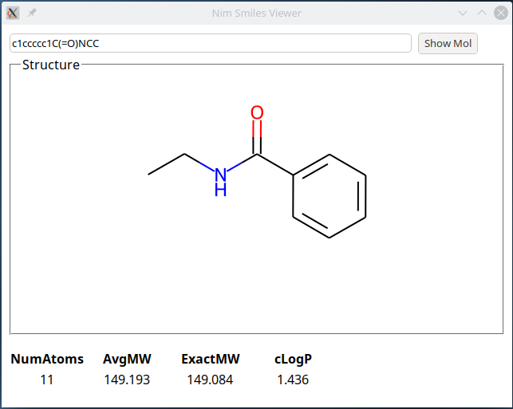

# Smiles Viewer

A Smiles structure viewer, written in [Nim](https://nim-lang.org), using [bindings](https://github.com/apahl/rdkit_nim) to the C++ cheminformatics toolkit [RDKit](http://rdkit.org/) and [Webview](https://github.com/marcomq/webview) as the UI.



# Installation

(only tested on Linux)

1. Install the RDKit as described for the [bindings](https://github.com/apahl/rdkit_nim).
1. Clone this repo and build with:

```
nimble buildDebug    # to build debug version in main directory

# or

nimble buildRelease  # for release build in `bin/` directory
```

# Running

```
LD_LIBRARY_PATH=/usr/lib/x86_64-linux-gnu:$RDKIT_CONDA/lib smiles_viewer  # (on Linux)
```

The `/usr/lib/x86_64-linux-gnu` part is needed on my machine for Webview to find the correct GTK libraries. 
